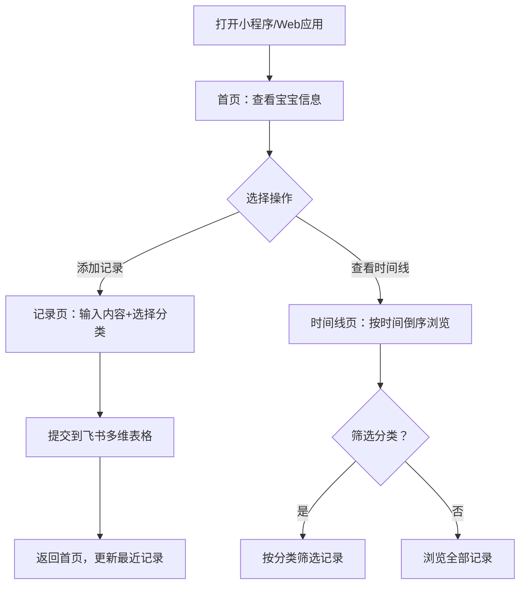

# 宝宝成长记录 — 产品需求文档 (PRD)

## 1. 产品概述

宝宝成长记录是一款面向 0-3 岁新手父母的 AI 育儿记录小工具 MVP。家长通过文字随手记录宝宝的日常点滴，数据自动存入飞书多维表格，并能在应用中查看成长时间线和里程碑。

- **核心问题**：新手父母忙碌中难以坚持记录宝宝的成长瞬间，缺乏系统化工具
- **目标用户**：0-3 岁新手父母，优先以单宝宝家庭起步
- **MVP 目标**：跑通"记录 → 存储 → 时间线展示"核心闭环，验证用户需求

## 2. 核心功能

### 2.1 用户角色

| 角色 | 说明 |
|------|------|
| 家长用户 | 无需注册登录，通过飞书授权使用，管理自家宝宝的成长记录 |

### 2.2 功能模块

**MVP 阶段包含 3 个核心页面：**

1. **首页（宝宝总览）**：宝宝基本信息卡片、最近记录预览、快捷记录入口
2. **记录页（添加记录）**：文字输入框、分类选择、提交保存
3. **时间线页（记录回顾）**：按时间倒序展示所有记录、分类筛选、里程碑标记

### 2.3 页面详情

| 页面名称 | 模块名称 | 功能描述 |
|---------|---------|---------|
| 首页 | 宝宝信息卡 | 展示宝宝姓名、出生日期、月龄、性别 |
| 首页 | 最近记录 | 显示最近 5 条记录，含分类标签和时间 |
| 首页 | 快捷记录入口 | 底部/侧边悬浮按钮，一键进入记录页 |
| 记录页 | 分类选择器 | 6 个分类图标按钮：饮食/睡眠/语言/运动/健康/其他 |
| 记录页 | 文字输入区 | 大文本框，支持输入宝宝日常记录 |
| 记录页 | 提交确认 | 提交后反馈成功动画，自动返回首页 |
| 时间线页 | 记录列表 | 时间倒序列表，每条含时间戳、分类标签、内容 |
| 时间线页 | 分类筛选 | 顶部横向滚动分类标签，支持按类型筛选 |
| 时间线页 | 里程碑标记 | 里程碑记录用特殊视觉标识（星星标记） |

## 3. 核心流程

## 4. 用户界面设计

### 4.1 设计风格

- **主色调**：温暖珊瑚粉 `#FF7B7B` + 柔和奶油背景 `#FFF8F5`
- **辅助色**：暖橙色 `#FFB347`（分类标签、里程碑标记）、天空蓝 `#7BCEFF`（信息卡片点缀）
- **字体**：标题用 Outfit Bold（圆润亲和），正文用 PingFang SC / 系统默认
- **布局**：单列纵向布局，适合手机单手操作；卡片式内容区，圆角 12px
- **氛围**：温暖、柔软、亲子感，避免冷冰冰的工具感
- **图标**：使用 emoji 作为分类和功能图标，增加趣味性和亲和力

### 4.2 页面设计概述

| 页面名称 | 模块名称 | UI 元素 |
|---------|---------|--------|
| 首页 | 顶部导航 | 产品名称 + 宝宝头像圆形缩略图 |
| 首页 | 宝宝信息卡 | 大卡片，显示姓名/月龄/性别，浅粉色底，圆角阴影 |
| 首页 | 最近记录 | 卡片列表，每条左侧分类 emoji + 右侧时间和正文片段 |
| 首页 | 悬浮按钮 | 右下角粉色圆形 "+"，点击进入记录页，带弹性动画 |
| 记录页 | 分类选择器 | 6 个圆形 emoji 按钮横排两行，选中态放大+高亮边框 |
| 记录页 | 输入区 | 大面积圆角文本框，placeholder "今天宝宝做了什么？" |
| 记录页 | 提交按钮 | 底部宽按钮，珊瑚粉色，文字"记录这一刻" |
| 时间线页 | 筛选栏 | 顶部横向滚动标签，未选中灰色、选中珊瑚粉 |
| 时间线页 | 记录卡片 | 左侧时间竖线 + 右侧内容卡片，里程碑带星标 |

### 4.3 响应式设计

- 桌面端：最大宽度 480px，居中显示，模拟手机界面
- 移动端：全宽自适应，触摸区域最小 44px
- 输入区针对移动端键盘弹出优化

## 5. 技术约束

- 数据存储：飞书多维表格（lark-base），无需自建后端数据库
- 无需用户系统：MVP 阶段使用单一飞书 Base，家长直接操作
- 部署：TRAE lark-apps 一键部署为可分享的 Web 链接
- 零服务器成本：纯前端 + 飞书 API 直连
