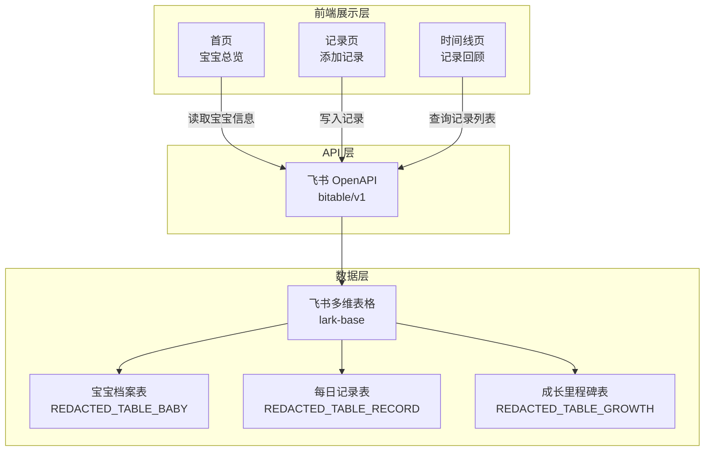
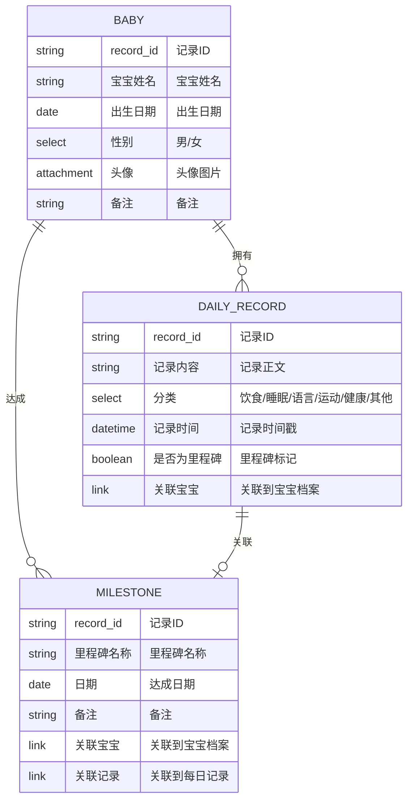

# 宝宝成长记录 — 技术架构文档

## 1. 架构设计



## 2. 技术选型

- **前端框架**：React@18 + TypeScript
- **构建工具**：Vite@5
- **样式方案**：Tailwind CSS@3 + CSS 变量（与现有 landing page 配色一致）
- **路由**：React Router v6（HashRouter，兼容静态部署）
- **HTTP 请求**：fetch API（直接调用飞书 OpenAPI）
- **部署**：TRAE lark-apps（静态站点托管）

## 3. 路由定义

| 路由 | 页面 | 说明 |
|------|------|------|
| `/` | 首页 | 宝宝信息卡 + 最近记录 + 快捷入口 |
| `/record` | 记录页 | 添加新记录（分类选择 + 文字输入） |
| `/timeline` | 时间线页 | 查看所有记录，支持分类筛选 |

## 4. API 定义

### 4.1 飞书多维表格 API

MVP 阶段通过飞书 OpenAPI 直连多维表格，使用以下接口：

#### 获取宝宝信息
```
GET /open-apis/bitable/v1/apps/{base_token}/tables/REDACTED_TABLE_BABY/records
  ?page_size=1
```

#### 创建每日记录
```
POST /open-apis/bitable/v1/apps/{base_token}/tables/REDACTED_TABLE_RECORD/records
Body: {
  "fields": {
    "记录内容": "今天学会说车车",
    "分类": "语言",
    "记录时间": 1718700000000,
    "是否为里程碑": true,
    "关联宝宝": ["recvmSNnuni5bU"]
  }
}
```

#### 查询记录列表
```
GET /open-apis/bitable/v1/apps/{base_token}/tables/REDACTED_TABLE_RECORD/records
  ?page_size=50
  &sort=[{"field_name":"记录时间","desc":true}]
  &filter=CurrentValue.[分类]="语言"
```

### 4.2 认证方式

使用飞书应用访问令牌（tenant_access_token），在前端通过飞书 JSAPI 或预配置 token 进行鉴权。

## 5. 数据模型

### 5.1 ER 图



### 5.2 飞书 Base 信息

| 表名 | Table ID | 说明 |
|------|----------|------|
| 宝宝档案 | `REDACTED_TABLE_BABY` | 存储宝宝基本信息 |
| 每日记录 | `REDACTED_TABLE_RECORD` | 存储每日喂养/成长记录 |
| 成长里程碑 | `REDACTED_TABLE_GROWTH` | 存储成长关键节点 |

Base Token: `REDACTED_BASE_TOKEN`

## 6. 项目结构

```
baby-growth-record/
├── index.html              # Vite 入口
├── package.json
├── vite.config.ts
├── tailwind.config.js
├── postcss.config.js
├── tsconfig.json
├── src/
│   ├── main.tsx            # 应用入口
│   ├── App.tsx             # 路由配置
│   ├── index.css           # Tailwind + 全局样式
│   ├── api/
│   │   └── feishu.ts       # 飞书 API 封装
│   ├── pages/
│   │   ├── HomePage.tsx    # 首页
│   │   ├── RecordPage.tsx  # 记录页
│   │   └── TimelinePage.tsx # 时间线页
│   ├── components/
│   │   ├── BabyCard.tsx    # 宝宝信息卡片
│   │   ├── RecordItem.tsx  # 单条记录组件
│   │   ├── CategoryPicker.tsx # 分类选择器
│   │   ├── FloatingButton.tsx # 悬浮按钮
│   │   └── FilterBar.tsx   # 分类筛选栏
│   └── utils/
│       ├── date.ts         # 日期/月龄计算
│       └── constants.ts    # 分类映射、配色常量
└── .trae/
    └── documents/
        ├── prd.md
        └── tech-arch.md
```
